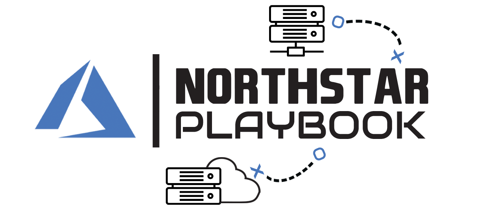

| Azure CI | Deploy ARM Template |
|:-------------|:--------------|
| [![azure-pipelines-linux-image][]][azure-pipelines-linux-site] |  |

[azure-pipelines-linux-image]: https://dev.azure.com/mscet/CET-NorthStar/_apis/build/status/master/CI%20-%20Linux?branchName=master
[azure-pipelines-linux-site]: https://dev.azure.com/mscet/CET-NorthStar/_build/latest?definitionId=8&branchName=master

- - -

This playbook will explore actionable architectural and implementation guidelines for large-scale enterprise Azure adoption, focusing on the platform "North Star" design that must occur prior to application deployments, to support cloud migrations and position customers on a strategic transformation path for cloud-native innovation.

In this regard, this repository is intended to support enterprise Azure adoption by leveraging learnings from previous engineering engagements to provide a common "North Star" design pattern for the CSU to better serve customers, where the "North Star" represents a strategic and ever-evolving design path for the customer platform, that is fully aligned with the Azure platform roadmap.

## Navigation Menu

* [North Star Architecture](./docs/NorthStar-Architecture.md)
  * [Design Principles](./docs/Design-Principles.md)
  * [Design Guidelines](./docs/Design-Guidelines.md)
    * [A - Enterprise Enrollment and Azure AD Tenants](./docs/A-Enterprise-Enrollment-and-Azure-AD-Tenants.md)
    * [B - Identity and Access Management](./docs/B-Identity-and-Access-Management.md)
    * [C - Management Group and Subscription Organization](./docs/C-Management-Group-and-Subscription-Organization.md)
    * [D - Network Topology and Connectivity](./docs/D-Network-Topology-and-Connectivity.md)
    * [E - Management and Monitoring](./docs/E-Management-and-Monitoring.md)
    * [F - Business Continuity and Disaster Recovery](./docs/F-Business-Continuity-and-Disaster-Recovery.md)
    * [G - Security, Governance and Compliance](./docs/G-Security-Governance-and-Compliance.md)
    * [H - Platform Automation and DevOps](./docs/H-Platform-Automation-and-DevOps.md)
  * [Implementation Guide](./docs/Implementation-Guide.md)
* [Contoso Reference](./docs/Contoso/Readme.md)
  * [Scope and Design](./docs/Contoso/Scope.md)
  * [Implementation](./docs/Contoso/Design.md)
* [Using reference implementation in your own environment](./docs/Deploy/Readme.md)
  * [Getting started](./docs/Deploy/Getting-Started.md)
    * [Prerequisites](./docs/Deploy/Prerequisites.md)
    * [Validate prerequisites](./docs/Deploy/Validate-prereqs.md)
  * [Configure own environment](./docs/Deploy/Using-Reference-Implementation.md)
    * [Configure GitHub and run initialization](./docs/Deploy/Configure-run-initialization.md)
    * [Deploy platform infrastructure](./docs/Deploy/Deploy-platform-infra.md)
    * [Deploy landing zones](./docs/Deploy/Deploy-lz.md)
    * [Trigger deployments locally](./docs/Deploy/Trigger-local-deployment.md)
  * [North Star ARM template](./docs/Deploy/NorthStar-schema.md)
  * [Known Issues](./docs/Deploy/Known-Issues.md)  
* [How Do I Contribute?](./docs/Northstar-Contribution.md)
* [FAQ](./docs/Northstar-FAQ.md)
* [Roadmap](./docs/Northstar-roadmap.md)

## Objective

The primary objective of this playbook is to **help CSAs define a "North Star" architecture for their customers**, considering requisite design decisions across fundamental technical topics and "what-must-be-true" before organization wide Azure adoption can occur.

## Audience

This playbook outlines architectural guidance for large-scale Azure adoption to provide critical insights for **CSAs and the broader CSU technical community** in support of enterprise migration/transformation projects.

## Prerequisites

To fully leverage the guidance contained within this playbook, readers must have a collaborative engagement with key customer stakeholders across critical technical domains, such as identity, security, and networking. Ultimately, the success of any large-scale migration hinges on cross-discipline cooperation within the customer organization, since key requisite "North Star" design decisions are cross cutting, and to be authoritative must involve domain SMEs and stakeholders within the customer.

It is also assumed that readers have a broad understanding of key Azure constructs and services in order to fully contextualise the prescriptive recommendations contained within this playbook.

## Contributing

This project welcomes contributions and suggestions.  Most contributions require you to agree to a
Contributor License Agreement (CLA) declaring that you have the right to, and actually do, grant us
the rights to use your contribution. For details, visit https://cla.opensource.microsoft.com.

When you submit a pull request, a CLA bot will automatically determine whether you need to provide
a CLA and decorate the PR appropriately (e.g., status check, comment). Simply follow the instructions
provided by the bot. You will only need to do this once across all repos using our CLA.

This project has adopted the [Microsoft Open Source Code of Conduct](https://opensource.microsoft.com/codeofconduct/).
For more information see the [Code of Conduct FAQ](https://opensource.microsoft.com/codeofconduct/faq/) or
contact [opencode@microsoft.com](mailto:opencode@microsoft.com) with any additional questions or comments.
