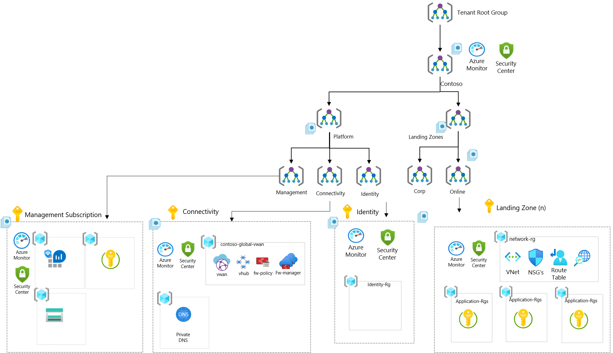

| North Star Design Principles | ARM Template | Scale without refactoring |
|:-------------|:--------------|:--------------|
|| | Yes |
# Deploy North Star with Azure VWAN 

## Customer profile
This reference implementation is ideal for customers that have started their North Star journey with a North Star Foundation implementation and then there is a need to add connectivity on-premises datacenters and branch offices by using Azure VWAN, ExpressRoute and VPN. This reference implementation is also well suited for customers who want to start with landing zones for their net new
deployment/development in Azure, where a global transit network is required, including hybrid connectivity to on-premises datacenters and branch offices via ExpressRoute and VPN.

## How to evolve from North Star Foundation
If customer started with a North Star Foundation deployment, and if the business requirements changes over time, such as migration of on-prem applications to Azure that requires hybrid connectivity, you will simply create the **connectivity** subscription and place it into the **platform** management group and assign Azure Policy for the VWAN network topology.

## Pre-requisites
To deploy this ARM template, your user/service principal must have Owner permission at the tenant root.
See the following [instructions](https://docs.microsoft.com/en-us/azure/role-based-access-control/elevate-access-global-admin) on how to grant access.

## What will be deployed?
- A scalable management group hiearchy aligned to core platform capabilities, allowing you to operationalize at scale using RBAC and Policy
- An Azure subscription dedicated for management, which enables core platform capabilities at scale such as security, auditing, and logging
- An Azure subscription dedicated for connectivity, which deploys core networking resources such as Azure VWAN, Azure Firewall, Firewall Policies, among others.
- An Azure subscription dedicated for identity, where customers can deploy the Active Directory domain controllers required for their environment
- Landing Zone management group for corp-connected applications that require hybrid connectivity. This is where you will create your subscriptions that will host your corp-connected workloads.
- Landing Zone management group for online applications that will be internet-facing, which doesn't require hybrid connectivity. This is where you will create your subscriptions that will host your online workloads.

